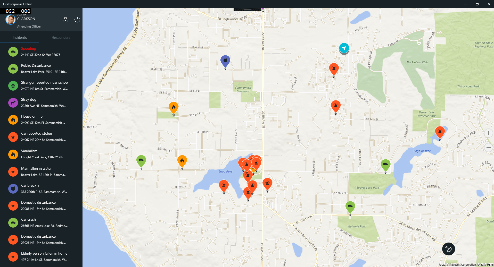
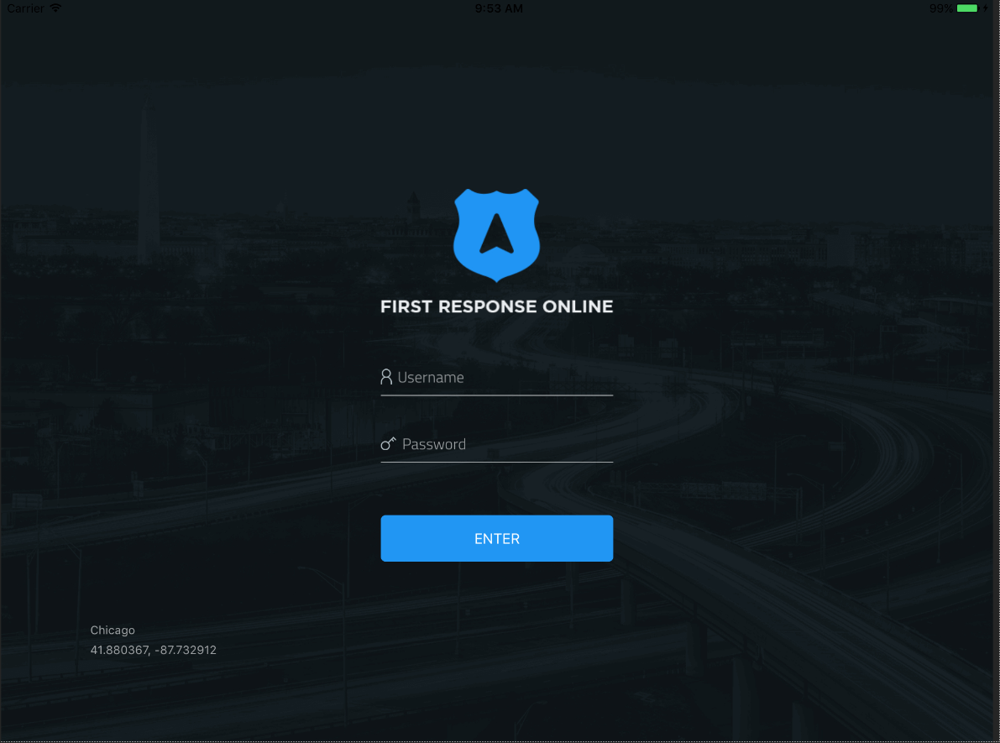
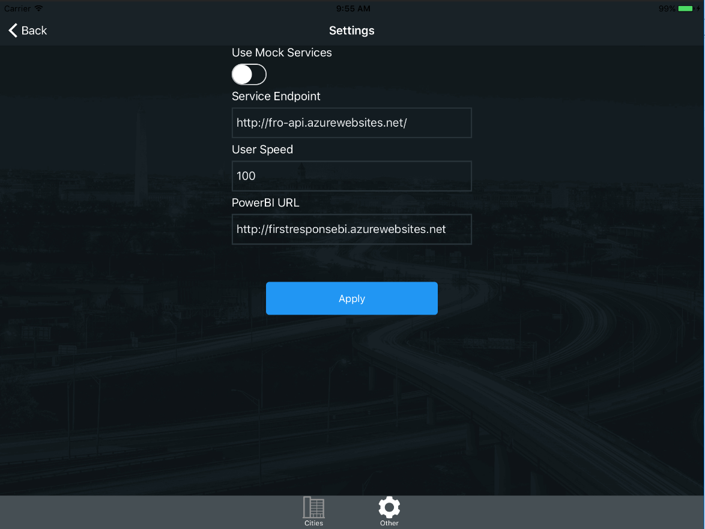
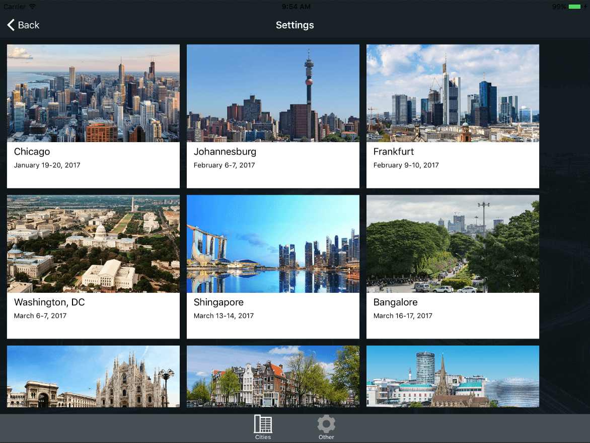
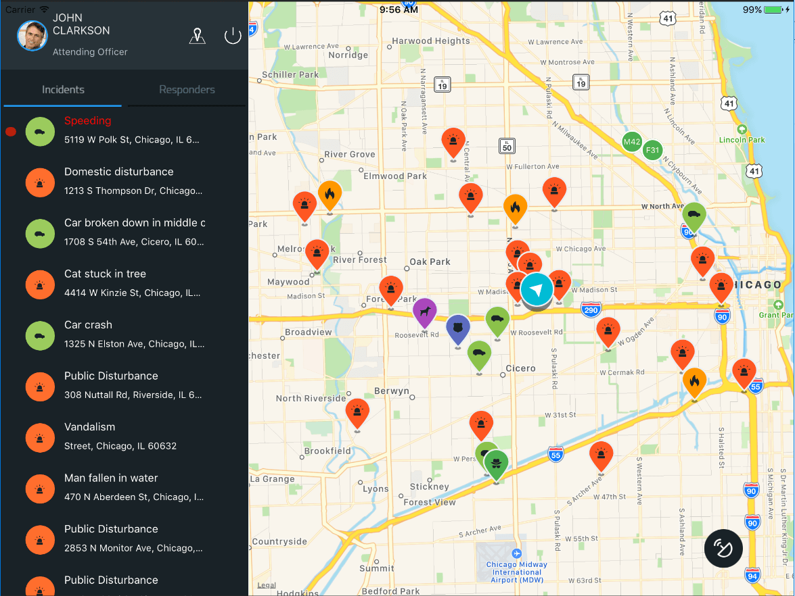
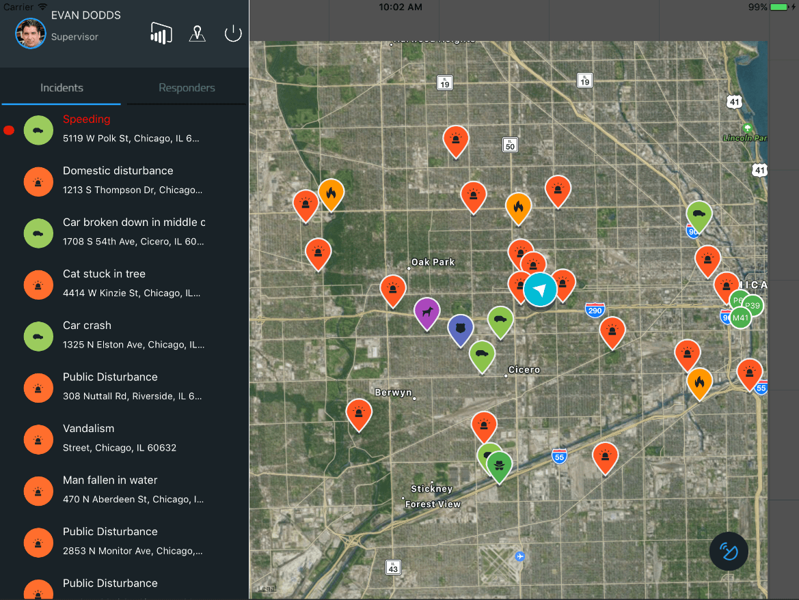
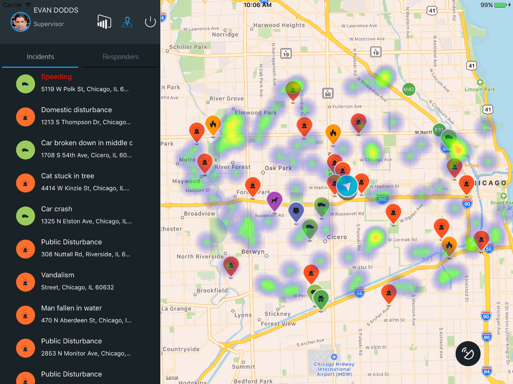
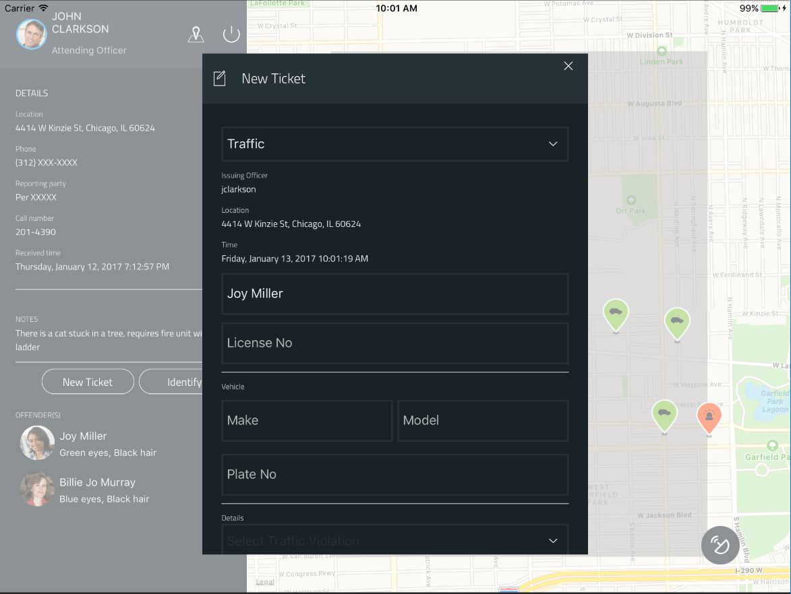
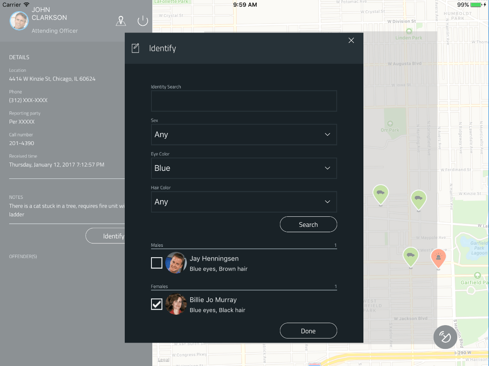
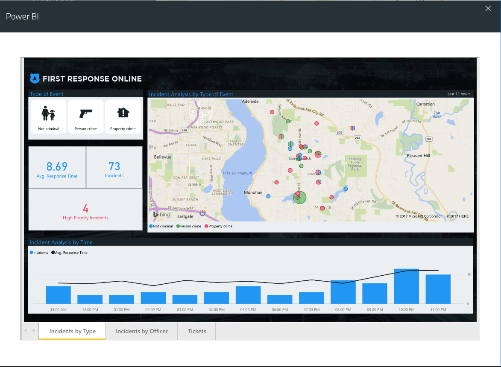

# FIRST RESPONSE ONLINE

First Response Online is a communication and collaboration platform built to support first responders. It lets police officers, fire fighters, and paramedics share critical data with each other in near real-time. It supports Android, iPad, and PC and integrates with computer aided dispatch and GPS tracking. Units in the field can update their status, complete traffic stops, and even query state & federal databases all without using the radio.
First Response Online has been successful tested at Azure.(By using services like App Service, Azure SQL, CosmosDB & Azure Search, First Response Online can instead focus on empowering first responders instead of maintaining infrastructure.)

Follow the [deployment instructions](Deploy/Deploy.md) to get you started.

### Supported platforms: iOS, Android and Windows

### The app architecture consists of two parts:
  1. A Xamarin.Forms mobile app for iOS, Android and Windows.
  2. ASP.NET MVC API.

## Xamarin.Forms App

This project exercises the following platforms, frameworks or features:

* Xamarin.Forms
  * XAML
  * Bindings
  * Converters
  * Central Styles
  * Custom Renderers
  * Animations
  * IoC
  * Messaging Center
  * Custom Controls
  * Cross Plugins
  * Pages and Popups
* ASP.NET MVC
  * C# backend
  * WebAPI
  * Entity Framework
  * Power BI Embedded

## Three platforms
The app targets **three** platforms:

* iOS
* Android
* Universal Windows Platform (UWP)
    * UWP supported only in Visual Studio, not Xamarin Studio

As of 20/04/2021, FRO features **79.9% code share** (19.9% iOS / 21.7% Android / 19.6% Windows).

## Licenses

This project uses some third-party assets with a license that requires attribution:

- [Xamarin.Plugins](https://github.com/jamesmontemagno/Xamarin.Plugins): by James Montemagno
- [ACR User Dialogs](https://github.com/aritchie/userdialogs): by Allan Ritchie
- [Xamarin.Forms Animation Helpers](https://github.com/jsuarezruiz/Xamanimation): by Javier Suárez
- [Popup Page Plugin for Xamarin Forms](https://github.com/rotorgames/Rg.Plugins.Popup): by Rotorgames
- [Toasts Notification Plugin](https://github.com/EgorBo/Toasts.Forms.Plugin): by Adam Pedley

## Screens

The app has the following screens:

* a auth screen
* a settings screen
* a main menu section to access to incidents and responders
* a detail map with incidents and responders
* a new ticket popup
* a identify popup
* a power bi popup

## Clean and Rebuild
If you see build issues when pulling updates from the repo, try cleaning and rebuilding the solution.

## Contributing
If you want to contribute please contact [support@i4e.com.bd](mailto:support@i4e.com.bd) with any additional questions or comments.
#Lupael
